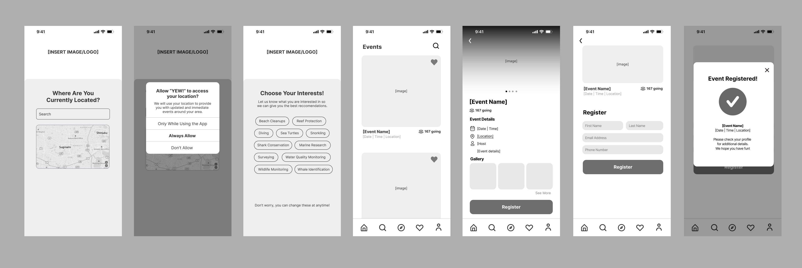
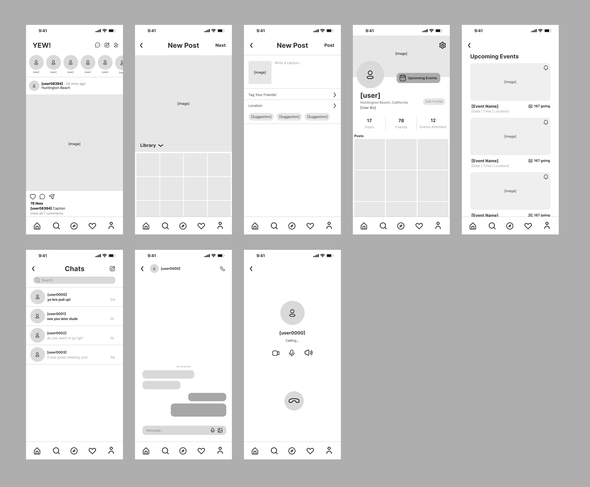
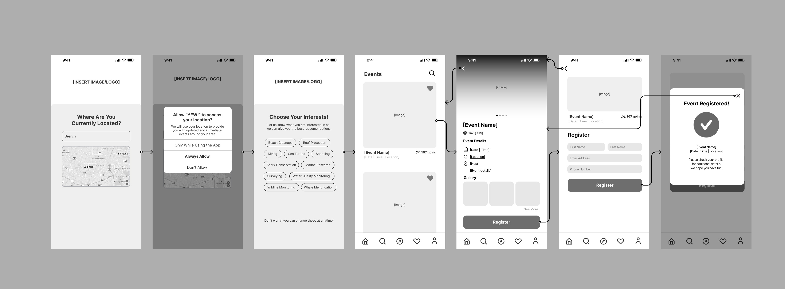
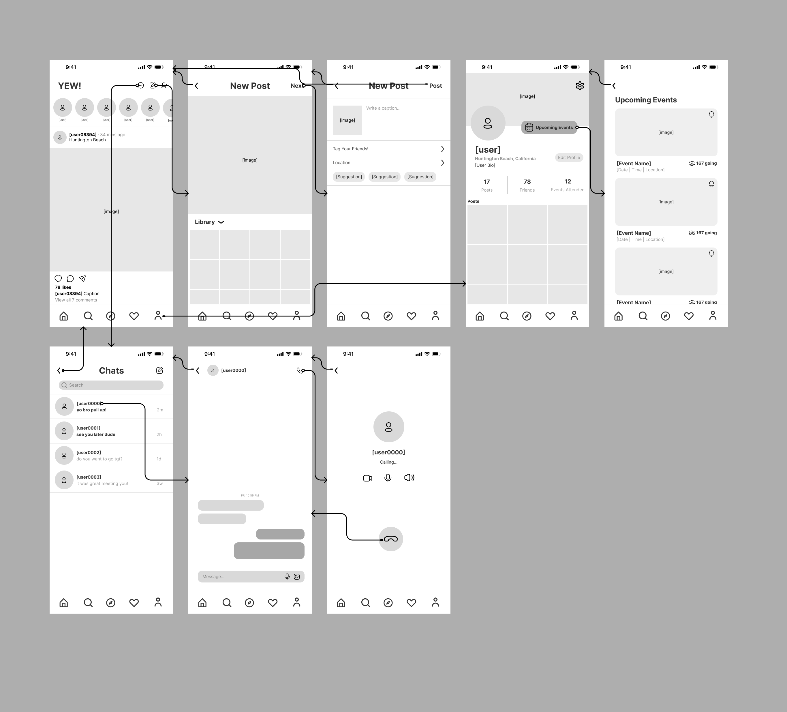
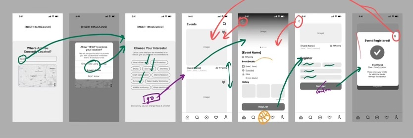
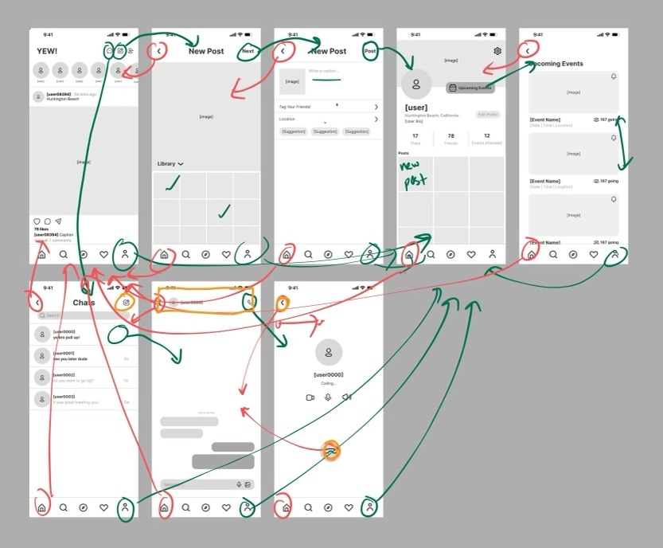

# ASSIGNMENT #05: Low Fidelity Prototype
_by Vicky Jen | DH 110: User Experience Design_

## Project Description

### User Research:
My project aims to boost community engagement in the surf community for volunteer events related to oceanic protection, to build a more bonded community with a stronger sense of awareness regarding environmental issues. The target user I am researching in this project is the surf community in the Southern California region as they are a population that is directly affected by some of these issues. Specifically, I am interested in finding out the reasons behind a lack of engagement, as well as how it could be more convenient for them to participate in such volunteer events. 

### User Persona + Features:
Based on my heuristic evaluation and user research, I created 2 personas that could represent two different types of users. 

Persona #1: Kanao Nakama is a 25 year old Japanese male professional surfer. He aspires to increase his engagement with volunteer events related to oceanic conservation by branching out to other surf communities. He is looking for a compilation of information on these events so he can organize his busy schedule accordingly.

Persona #2: Kirra Williams is a 22 year old Australian Graphic Designer at Amazon. She just moved to the country and is looking for a tight knit surf-community. She is also passionate about oceanic protection and is looking for suitable volunteer opportunities in her area. 

There will be two features implemented in the application targeting Kanao and Kirra’s struggles. 

- **Feature 1:** The main function of the app will be to recommend volunteer opportunities and events based on their location, interests, and time availability. 

- **Feature 2:** An additional feature to boost user engagement is a social aspect that allows users to connect with one another through follows, posts, shares, likes, and comments to document the event, and leave user reviews. This feature will keep the users active on the app to stay updated with live information. 

### Purpose:
The purpose of a low fidelity prototype is to translate high-level design concepts into tangible and testable screens. It allows for early on testing with users to check and test the functionality of the wireflow. It also allows for the designer and researcher to visualize the product before implementing additional design elements. 

### Wireframes:
#### Feature #1

#### Feature #2

### Wireflow:
#### Feature #1

#### Feature #2

### Testing:
After completing the first draft of the low fidelity prototype, I asked a user to help test the two features of the application in terms of navigation, flow, and how natural it felt. The video was recorded on zoom whilst screen sharing on an ipad.

Please find the full recording of the testing [here](https://drive.google.com/file/d/1thi95iwfNH1Rjo90ijREl1spQg0qQb9l/view?usp=sharing). 

**Documentation of how the user interacted with the wireframes:**

Notes: The user was confused on screen 3 as there was no button to advance to the next screen after choosing their interest. The user also felt that using a different word for the registering page such as confirm could help differentiate between the two similar pages. Additionally, he suggested that the confirmation page be its own screen so the user can anticipate what will happen after they exit out of the confirmation screen. 

Notes: The user thought there could be an additional feature for users to create new chats with new friends. He also thought that it was odd there was both an ‘x’ as well as ‘end call’ button on the call screen as they both supposedly lead to the same screen. Overall everything was pretty self explanatory, however the home icon and safari icon was a little confusing as social media apps typically use the home icon for their friends feed. Whereas “YEW!” uses the safari for their friends feed. So, he suggested I change the icon into a globe or enlarge the icon in the tab. 

