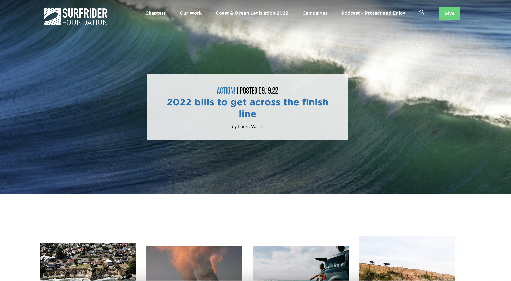

# ASSIGNMENT #01: Heuristic Evaluation

## Ocean Conservation and Protection in California 
##### _By Vicky Jen| DH110: User Experience and Design_

### About The Project
This project will focus on the 14th Sustainable Development goals of 'Life Below Water' established by the United Nations to "conserve and sustainably use the oceans, sea, and marine resources for sustainable development". The project will mainly focus on the act of spreading information and awareness regarding Ocean conservation and protection in a variety of ways specifically in California, United States.  

As a student living in Los Angeles and an International student from Taiwan, I've been surrounded by the ocean my whole life, yet I have never been around it much until this last year. Learning how to surf has made me realize the lack of awareness regarding oceanic issues amongst the general community. However, being in the water constantly to surf, I've been able to see first-hand some effects of oceanic pollution. 

I want to use this UI project to create a website or mobile app to raise awareness about Oceanic protection to educate the general community on this topic to raise funds and support these causes. I want to create a website/app is able to identify the problem, explain it, show it, and convince the user to dontate towards it. In this assignment, I will be conducting a heuristic evaluation through examining the 10 Usability Heuristics of User Interface Designs and Severity Ratings for Usability Problems. The two websites are, Ocean Protection Council and Surfrider Foundation. 

## Website 1 : [https://www.opc.ca.gov/]

##### Background Information 
The California Ocean Protection Council (OPC) was created by the California Ocean Protection Act (COPA), to ensure that California maintains healthy, resilient, and productive ocean and coastal ecosystems for the benefit of current and future generations. It mainly provides notes and information on meetings the council holds as well as the latest news.

 ##### Heuristic Evaluation 
_Overall Evaluation_: The website has structure and potential to it, however there are multiple missing and nonfunctional links. Many of the important tabs do not function, thus making it very hard for the user to navigate their way through, and gain an understanding of the purpose of this site. Furthermore, the website is also crowded with large chunks of text as well as technical jargon, making it difficult for the user to catch important information. 

<table>
  <tr>
   <td>Heuristic & Description
   </td>
   <td>Evaluation
   </td>
   <td>Recommendation for “Bad” Element(s)
   </td>
   <td>Severity of “Bad” Element(s)
   </td>
  </tr>
  <tr>
   <td>1. <strong>Visibility of system status</strong>

The website clearly informs the user about its current status
   </td>
   <td>Good: The website highlights the tab that the user is currently in to indicate where they are in the website. 

Bad: The website has missing links to 3/6 tabs, making it a poor website as it does not function. 

Bad: The website’s highlighting function has a glitch where two tabs are highlighted at the same time. 
   </td>
   <td>Update the links so they function and make sure the highlighting function matches the open tab. 
   </td>
   <td>3
   </td>
  </tr>
  <tr>
   <td>2. <strong>Match between system and the real world</strong>

The website should use words, phrases, and concepts familiar to the user and avoid internal jargon. 
   </td>
   <td>Good: The website links unfamiliar words or organizations to separate pages related to it. 

Bad: The website has an overload of jargon and uses acronyms too early on. 

Bad: The website does not use full sentences for article headings. 
   </td>
   <td>Reduce the amount of internal jargon, use full comprehensive sentences for headings, and make the headings shorter. 
   </td>
   <td>3
   </td>
  </tr>
  <tr>
   <td>3. <strong>User control and freedom</strong>

The website allows for the user to undo and cancel unwanted actions easily. 
   </td>
   <td>Bad: The website does not have a place for users to perform actions
   </td>
   <td>Allow for the user to contact them through the website by inputting an interactive comment box.
   </td>
   <td>3
   </td>
  </tr>
  <tr>
   <td>4. <strong>Consistency and standards</strong>

The website maintains standard conventions. 
   </td>
   <td>Good: The different tabs are located in the header, where it remains in place the user as they scroll. 

Bad: The different tabs the website has are unconventional and unclear about its purpose.
   </td>
   <td>The tabs should be worded more simply and straightforward. Eg. instead of “strategic priorities”, it could be “take action” to target the user’s experience. 
   </td>
   <td>3
   </td>
  </tr>
  <tr>
   <td>5. <strong>Error prevention</strong>

The website prevents errors by checking thoroughly and showing an error page when needed.
   </td>
   <td>Bad: The website does not have an error page, some functions simply don’t respond. 
   </td>
   <td>The website should be up to date with working tabs, if not it should have error pages. 
   </td>
   <td>3
   </td>
  </tr>
  <tr>
   <td>6. <strong>Recognition rather than recall</strong>

The website helps users remember information with helpful tips.
   </td>
   <td>Bad: The website does not have reminders to show the user what they are looking at. 
   </td>
   <td>The website should use tabs, hashtags, or subgroups to sort the different information presented to the user. Eg. Meeting, Article..etc
   </td>
   <td>2
   </td>
  </tr>
  <tr>
   <td>7.<strong> Flexibility and efficiency of use</strong>

The website design caters to both experienced and inexperienced users.
   </td>
   <td>Bad: The website does not have a clear path to show the user how to navigate through the information. The website is very user unfriendly, it feels like it’s only made for the government who maintains the site. 
   </td>
   <td> The website should try to think from the user’s perspective and have general directions to find information. Eg. Which propositions/fundings  are for what actions.
   </td>
   <td>3
   </td>
  </tr>
  <tr>
   <td>8. <strong>Aesthetic and minimalist design</strong>

The website only contains relevant information.
   </td>
   <td>Bad: The website contains large amounts of unexplained information in messy orders. It feels like a personal notes app with no structure. 
   </td>
   <td>The website should remove any unnecessary notes and jargon into a different page and only keep relevant information regarding the meeting/article. 
   </td>
   <td>3
   </td>
  </tr>
  <tr>
   <td>9. <strong>Help users recognize, diagnose, and recover from errors</strong>

The error messages are clear and easy to understand
   </td>
   <td>Bad: The website does not have error pages.
   </td>
   <td>The website should have error pages to state why the link is not working.
   </td>
   <td>3
   </td>
  </tr>
  <tr>
   <td>10. <strong>Help and documentation</strong>

The website provides instructions 
   </td>
   <td>Bad: the website does not have a place for users to execute tasks besides from zoom links for meetings.
   </td>
   <td>The website should allow users to take action regarding the issues brought up regarding oceanic protection. 
   </td>
   <td>3
   </td>
  </tr>
</table>

## Website 2: [[https://california.surfrider.org/](https://california.surfrider.org/)]

##### Background Information 

The California Surfrider Foundation is a non-profit environmental organization that works to protect and preserve the world's oceans, waves and beaches. The website focuses on spreading awareness regarding this topic to promote donations towards these causes.

 ##### Heuristic Evaluation 

_Overall Evaluation_: The website is very well-rounded in terms of information, links, and places to donate. The primary function of the website flows well, and is organized in a comprehensive manner. 

<table>
  <tr>
   <td>Heuristic & Description
   </td>
   <td>Evaluation
   </td>
   <td>Recommendation for “Bad” Element(s)
   </td>
   <td>Severity of “Bad” Element(s)
   </td>
  </tr>
  <tr>
   <td>1. <strong>Visibility of system status</strong>

The website clearly informs the user about its current status
   </td>
   <td>Good: The website shows very clearly where the user is located with big headers. 

Good: The website headers are highlighted when hovered over.
   </td>
   <td>N/A
   </td>
   <td>1
   </td>
  </tr>
  <tr>
   <td>2. <strong>Match between system and the real world</strong>

The website should use words, phrases, and concepts familiar to the user and avoid internal jargon. 
   </td>
   <td>Good: Each portion of the website has a short description in easy to understand language targeting the user. 

Bad: The description is a little short and could be more descriptive
   </td>
   <td>Include a more detailed descriptions to help the user understand what these different topics are better. 
   </td>
   <td>2
   </td>
  </tr>
  <tr>
   <td>3. <strong>User control and freedom</strong>

The website allows for the user to undo and cancel unwanted actions easily. 
   </td>
   <td>Good: The website has places to allow the user to cancel donations

Good: The website’s header is always there for the user to return to the homepage or previous page.

Bad: After clicking cancel on the donation page, the website leads to the nationwide Surfrider page instead of the California branch – where the user initially started.
   </td>
   <td>Redirect the user back to the California Surfrider website instead of Nationwide Surfrider to maintain consistency
   </td>
   <td>1
   </td>
  </tr>
  <tr>
   <td>4. <strong>Consistency and standards</strong>

The website maintains standard conventions. 
   </td>
   <td>Good: The website follows the general standard for climate conservation websites with similar terms. Eg. Donate, Campaigns..etc

Bad: The website is a branch of the nationwide website, but it is not consistent with it.
   </td>
   <td>The branch website for Surfrider California should be as structured and well made as the nationwide one to maintain consistency. 
   </td>
   <td>2
   </td>
  </tr>
  <tr>
   <td>5. <strong>Error prevention</strong>

The website prevents errors by checking thoroughly and showing an error page when needed.
   </td>
   <td>Good: The website does not have error pages as all links are working
   </td>
   <td>N/A
   </td>
   <td>1
   </td>
  </tr>
  <tr>
   <td>6. <strong>Recognition rather than recall</strong>

The website helps users remember information with helpful tips.
   </td>
   <td>Good: The website constantly reminds users of what the purpose as well as the location this site is focusing on (California).
   </td>
   <td>N/A
   </td>
   <td>1
   </td>
  </tr>
  <tr>
   <td>7.<strong> Flexibility and efficiency of use</strong>

The website design caters to both experienced and inexperienced users.
   </td>
   <td>Good: The website is easy to use for first-time users, but can also be used and accessed quickly by experienced users. 

Bad: There is no description for the “Coast & Legislation 2022” tab and only links.
   </td>
   <td>Provide a description about what “Coast & Legislation 2022” is about. 
   </td>
   <td>2
   </td>
  </tr>
  <tr>
   <td>8. <strong>Aesthetic and minimalist design</strong>

The website only contains relevant information.
   </td>
   <td>Good: The website is very minimalistic, well structured with bold headers, making it easy for the user to navigate. 
   </td>
   <td>N/A
   </td>
   <td>1
   </td>
  </tr>
  <tr>
   <td>9. <strong>Help users recognize, diagnose, and recover from errors</strong>

The error messages are clear and easy to understand
   </td>
   <td>Good: The website has no error messages needed
   </td>
   <td>N/A
   </td>
   <td>1
   </td>
  </tr>
  <tr>
   <td>10. <strong>Help and documentation</strong>

The website provides instructions 
   </td>
   <td>Good: The website’s donation page is extremely simple.

Bad: The donation page may be a little too simple.
   </td>
   <td>The donation page could be more convincing with a motivating/inspiring reminder about the cause the user is supporting.
   </td>
   <td>1
   </td>
  </tr>
</table>
