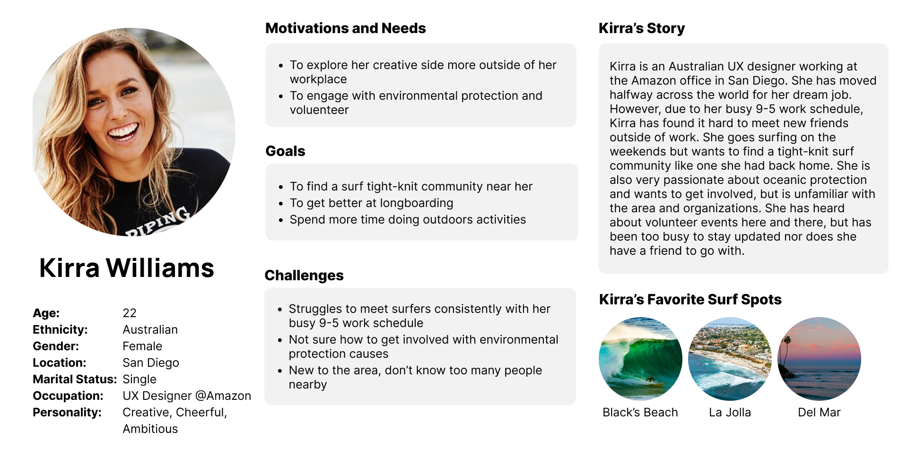

# ASSIGNMENT #04: Persona + Scenario
_by Vicky Jen | DH 110: User Experience Design_

## Purpose of UX storytelling
The purpose of UX storytelling is to build empathy by creating realistic stories and scenarios to see from the user’s point of view. Storytelling can be utilized as powerful tools to provide insight about their story, behavior, and pain points. By generating an overall sense of what a potential user could look like, this can help the team get on the same page to target pain points and generate solutions. Ultimately, it aims to gear the product towards the user’s needs and wants to create a better user experience for them. In my project, creating user personas can be beneficial to understand the way surf communities feel about oceanic protection to target this particular audience. Furthermore, it can also show pain points different users face when deciding whether to attend a community service event. 

## Tasks
- **Recommend events based on user’s information (location, interests):** The application will compile a database of updated community service events related to oceanic protection and create personalized recommendations based on the user’s location and interests.
- **Social aspect for the users:** User’s can follow each other, post, share, like, and comment to document the event, leave reviews, and befriend one another after attending the event. 

## User Personas

