# ASSIGNMENT #06: Interface Design
_by Vicky Jen | DH 110: User Experience Design_

## 📋 Project Description

This project aims to boost engagement within the surf community in southern california with ocean conservation and protection volunteer events. The project will produce an application that serves as a platform for easier access to information about related events and also connect surfers with one another through similar interests. 

### Purpose of Interface Design
The purpose of this interface design is to build upon the low-fidelity prototype into an interactive prototype with a fully flushed out design system. This will establish the skeleton of the application for future designs and improvements, as well as allow for better usability testing to gain valuable feedback. 

### Process
This high fidelity prototype is improved and built upon from the low fidelity prototype. I created it using Figma with a Iphone 13 Pro Max screen size (428x926px). By using the screens of the low fidelity prototype, I first determined the structure and layout of the application by using rows and columns as design guide. Then, I experimented with different typographies and shape variations. Following, I developed a color palette for both light and dark mode. And finally, I used a color contrast checker to ensure the color palette was legible and readable to the user before designing the final prototype of the chosen wireframe. Both dark and light modes were designed for the final prototype. 

[Figma Wireframe](https://www.figma.com/file/YZFMiLIPOr4Ci9PMrCeFs5/DH-110-Prototype---Assignment-06?node-id=0%3A1) 

[Figma Prototype](https://www.figma.com/proto/YZFMiLIPOr4Ci9PMrCeFs5/DH-110-Prototype---Assignment-06?page-id=0%3A1&node-id=12%3A677&viewport=-453%2C-130%2C0.17&scaling=scale-down&starting-point-node-id=12%3A677&show-proto-sidebar=1) (Light & dark mode with scrolling and hover states)

## 🎨 Screen Interface Designs

### Overall Layout
For my layout design, I used **8 rows by 5 columns** with a **margin of 32px** and **gutter of 16px**. This was a fitting layout that could display images in a comfortable size. Images are a crucial part of this application as that is a part of what will incentivize users to sign up for the events. The margins are set to 32px to give the design a more spacious feel to prevent the users from feeling overwhelmed.

### Typographic Variations 
I chose to experiment with **sans-serif** fonts to give the design a more modern feel as this app aims to break the stereotypes of community service and modernize the system. Below are Circular STD, Poppins, and Lato. These three fonts are all clean and easily readable/legible. However, I decided to go with **Circular STD** as it was the most stylistically neutral since the app is meant to be a platform to serve the users and not attract attention to bold stylistic choices. 

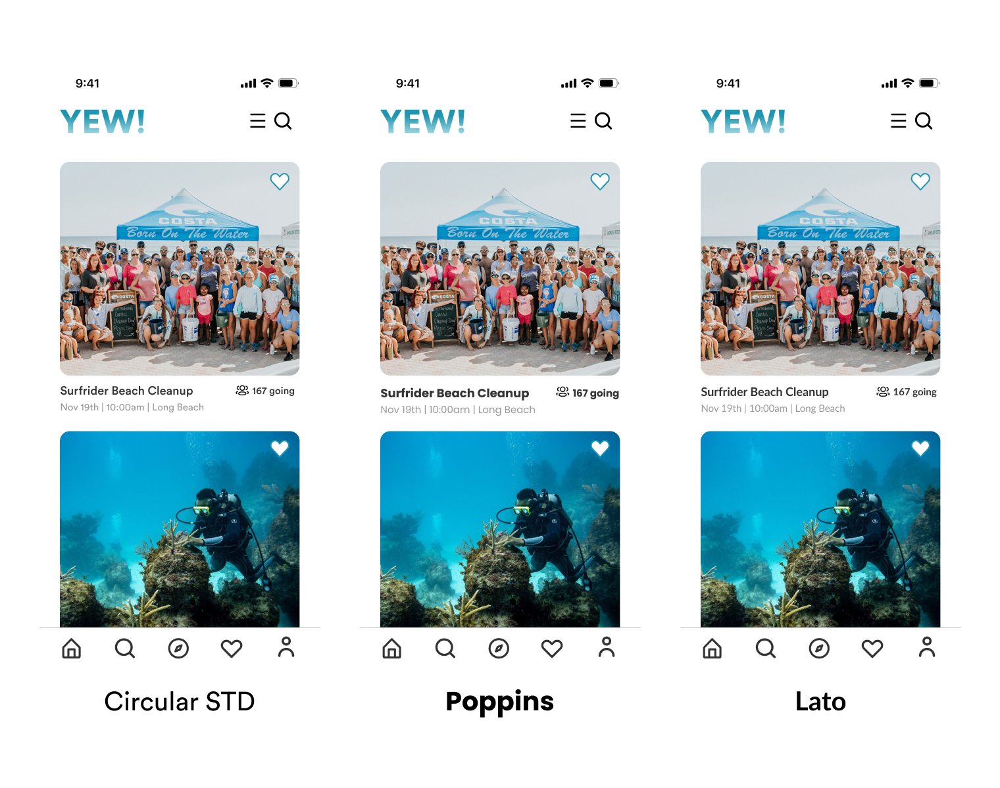

### Shape Variations
To make the design feel more friendly, I chose to use **rounded edges** for all the images, buttons and rectangular shapes in the app. I experimented with a corner radius of 3px, 10px, and 15px. I chose to use 15px as it felt the most visually appealing to me. Additionally, I played around with the location of the like button for users to save an event to their favorites. I chose the middle design because it felt the most natural and convenient to press with a thumb when using the phone. 

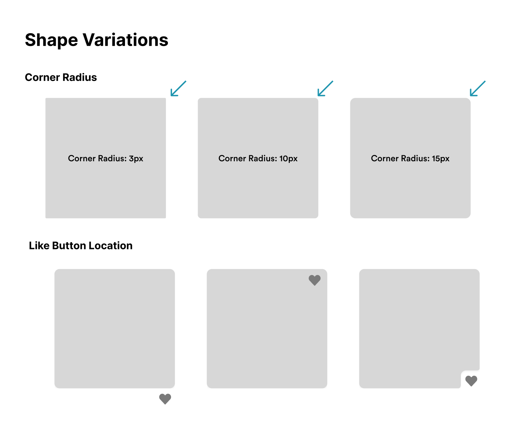
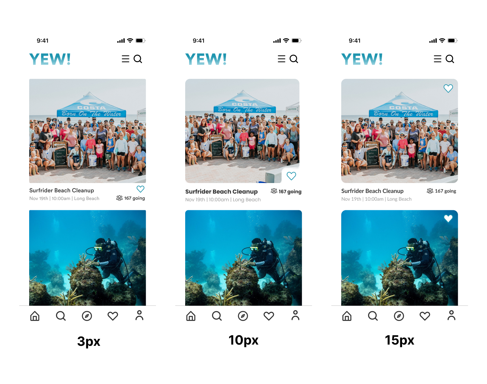

### Color Palettes
With the **Sapphire Teal** as the primary color, I created corresponding light and dark mode color palettes. This is to match the ocean theme of the project, adding to the overall intentions of the application. 

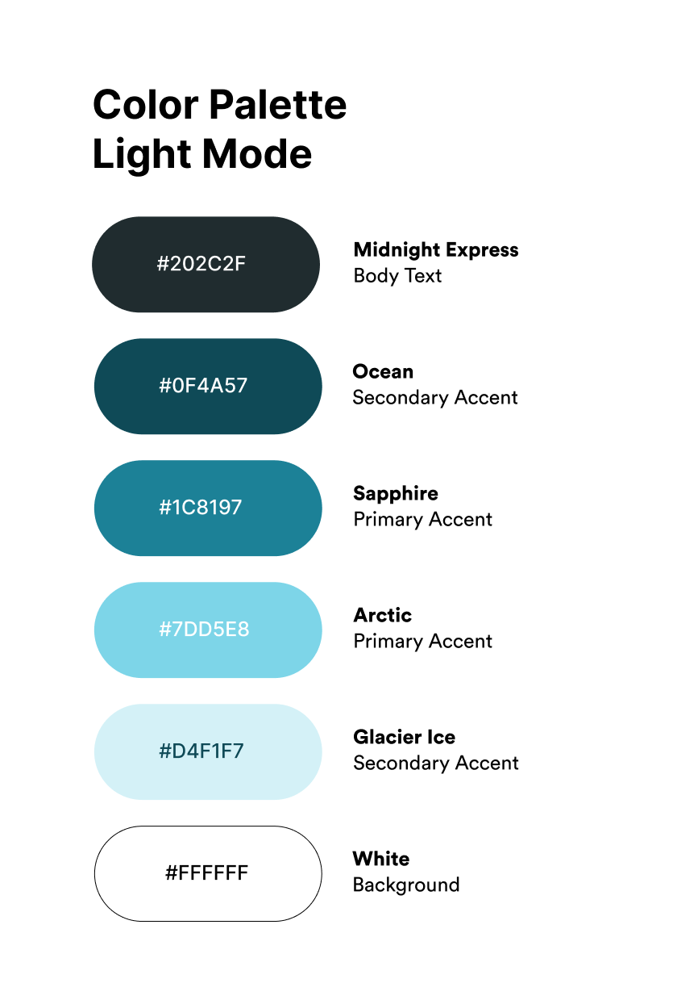 
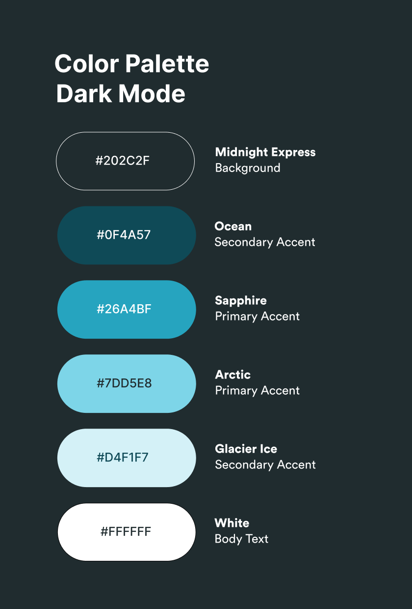
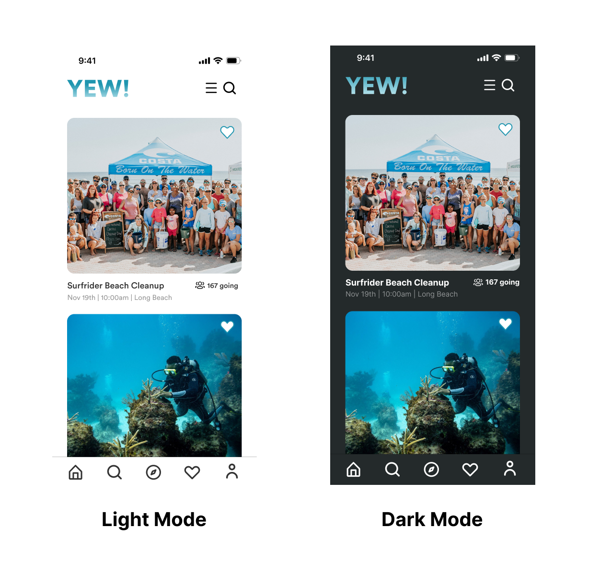

## 📝 Impression Testing
Impression Testing Screen Recording [here](https://drive.google.com/file/d/1nEhU2o0lVRtuZMAx-8Y_Bneq4ggEs0T9/view?usp=sharing)

Summary of Findings:
Logo was clear, visible, and recognizable
Color theme was blue, like button was blue, created a sense of cohesion
App theme was surfing based on images
Function of app is events with supporting text and images 
Images were big and clear which is helpful since it is a phone application
Font was legible, easy to read
General impression was simple, clean, professional, minimalistic, not overwhelming

## ✅ Accessibility + Contrast Check
To ensure the color palettes pass the WCAG guidelines, I used a contrast checker to make sure everything is legible. 
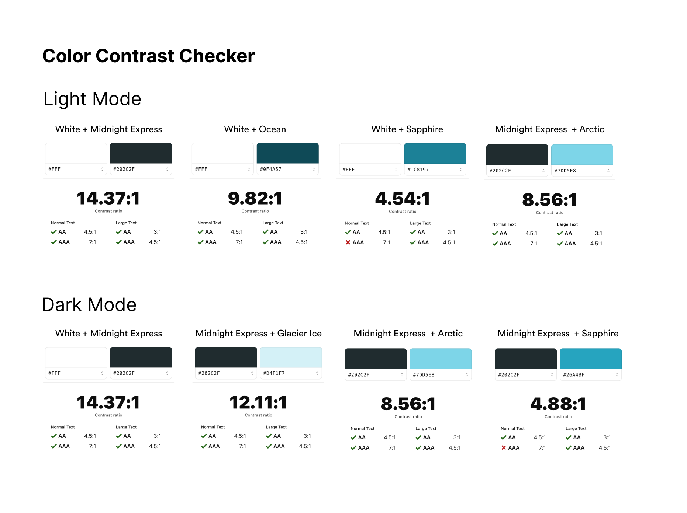

## 📱 Final Screen Design + Design System
### Final Screen 
This is the final scrolling screen design in the default light mode with Circular STD, and 15px rounded radius rectangles, and the like button on the top right of the image. 

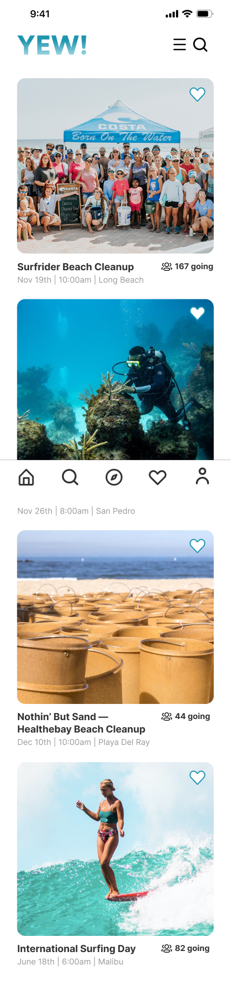

### Layout
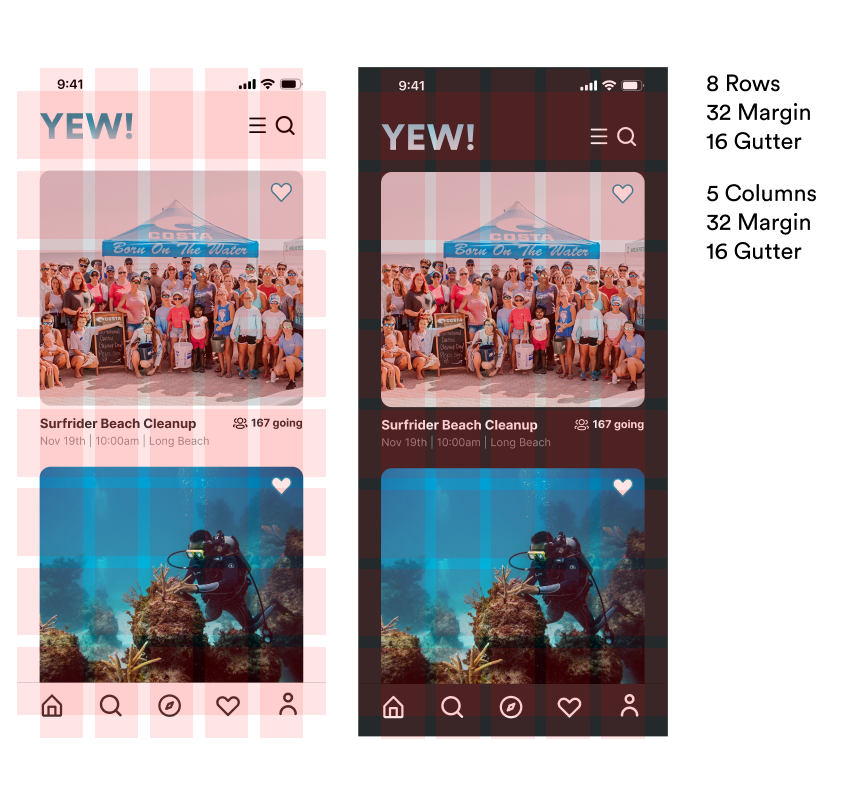

### Typography
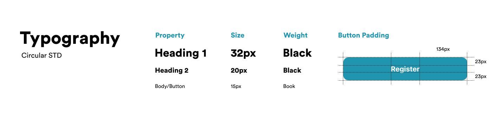

### Color Palette

### Shape Variation
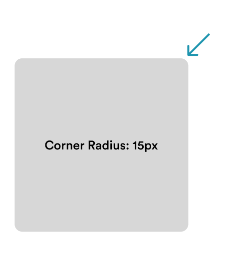
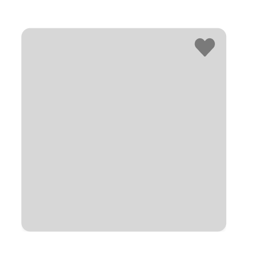

### Summary of Design Decisions 
Typography: I chose to use Circular STD to keep the interface modern, clean, and sleek as this platform aims to reduce cluttering information that may incentivize the user to register for an event. It is key that information is readable and legible. 

Color Palette: Teal is a staple color of the ocean, and to the surf-community this color intends to evoke familiarity and a feeling of freshness. It is not overwhelming but is vibrant enough to create fun and engaging designs. 

Layout: I wanted to give the user enough space to breathe on the application, to feel comfortable looking and reading when using the platform. Thus, the gutter is slightly larger and does not fill up the entire screen. The layout is also utilized to create appropriately sized images to capture the user’s attention. 
