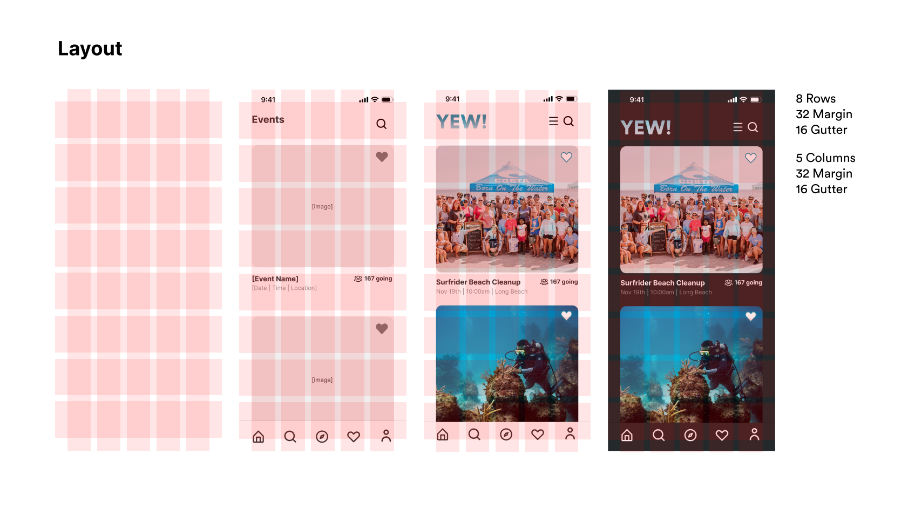
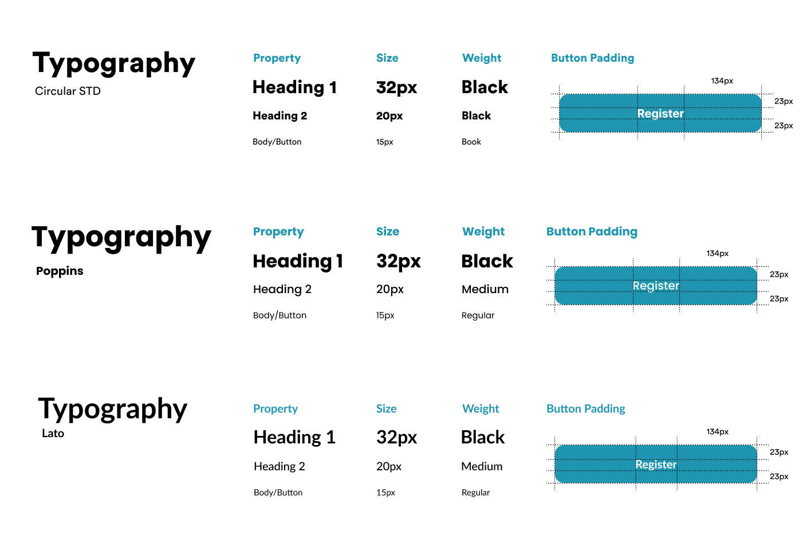

# ASSIGNMENT #06: Interface Design
_by Vicky Jen | DH 110: User Experience Design_

## 📋 Project Description

This project aims to boost engagement within the surf community in southern california with ocean conservation and protection volunteer events. The project will produce an application that serves as a platform for easier access to information about related events and also connect surfers with one another through similar interests. 

### Purpose of Interface Design
The purpose of this interface design is to build upon the low-fidelity prototype into an interactive prototype with a fully flushed out design system. This will establish the skeleton of the application for future designs and improvements, as well as allow for better usability testing to gain valuable feedback. 

### Process
This high fidelity prototype is improved and built upon from the low fidelity prototype. I created it using Figma with a Iphone 13 Pro Max screen size (428x926px). By using the screens of the low fidelity prototype, I first determined the structure and layout of the application by using rows and columns as design guide. Then, I experimented with different typographies and shape variations. Following, I developed a color palette for both light and dark mode. And finally, I used a color contrast checker to ensure the color palette was legible and readable to the user before designing the final prototype of the chosen wireframe. Both dark and light modes were designed for the final prototype. 

[Figma Wireframe](https://www.figma.com/file/YZFMiLIPOr4Ci9PMrCeFs5/DH-110-Prototype---Assignment-06?node-id=0%3A1) 

[Figma Prototype](https://www.figma.com/proto/YZFMiLIPOr4Ci9PMrCeFs5/DH-110-Prototype---Assignment-06?page-id=0%3A1&node-id=12%3A677&viewport=-453%2C-130%2C0.17&scaling=scale-down&starting-point-node-id=12%3A677&show-proto-sidebar=1) (Light & dark mode with scrolling and hover states)

## 🎨 Screen Interface Designs

### Overall Layout
For my layout design, I used 8 rows by 5 columns with a margin of 32px and gutter of 16px. This was a fitting layout that could display images in a comfortable size. Images are a crucial part of this application as that is a part of what will incentivize users to sign up for the events. The margins are set to 32px to give the design a more spacious feel to prevent the users from feeling overwhelmed.

### Typographic Variations 
I chose to experiment with Sans-Serif fonts to give the design a more modern feel as this app aims to break the stereotypes of community service and modernize the system. Below are Circular STD, Poppins, and Lato. These three fonts are all clean and easily readable/legible. However, I decided to go with Circular STD as it was the most stylistically neutral since the app is meant to be a platform to serve the users and not attract attention to bold stylistic choices. 

