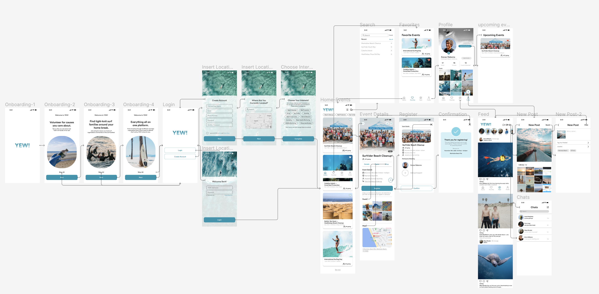

# ASSIGNMENT #07: High Fidelity Interactive Prototype
_by Vicky Jen | DH 110: User Experience Design_

## 📋 Project Description
This project aims to boost engagement within the surf community in southern california with ocean conservation and protection volunteer events. The project will produce an application that serves as a platform for easier access to information about related events and also connect surfers with one another through similar interests. 

### Purpose of Interactive Prototype
The purpose of this high fidelity interactive prototype is to represent the true application to be able to conduct effective usability tests to the target user groups. It can more accurately collect true human performance data in terms of time it takes to complete tasks, and how the user feels about the overall experience. 

### Process
This high fidelity interactive prototype is developed from the interface design. I created it using Figma with a Iphone 13 Pro Max screen size (428x926px). I used the low-fidelity prototype as a base structure and to determine the flow of each task. Then, I applied the design elements accordingly along with real life events and user personas that were previously created. I focused on creating a comprehensive representation of what the YEW! Application would look like if generated into a product. Paying attention to UI details, dead-ends, as well as common sense and logic. 

## ✅ Tasks
1. Login and create a new account 
2. Browse and register for an event
3. Create posts, browse social feed, and chat feature
4. View favorite and upcoming events 

## 📱 Interactive Prototype 

Screenshot of prototype wireflow with interface design implemented.

- [Figma Wireflow](https://www.figma.com/file/KB3imwQgNgGI63xchK8ihK/DH-110-Hi-Fi-Prototype---Assignment-07?node-id=79%3A4039&t=1z8BuzZiB4MpyLgh-1)
- [Figma Prototype](https://www.figma.com/file/KB3imwQgNgGI63xchK8ihK/DH-110-Hi-Fi-Prototype---Assignment-07?node-id=1%3A3336&t=1z8BuzZiB4MpyLgh-1)

<table>
  <tr>
   <td>Please enter the name of designer whose work you are to review
   </td>
   <td>vicky jen
   </td>
   <td>vicky jen
   </td>
   <td>note
   </td>
  </tr>
  <tr>
   <td>What do you see?
   </td>
   <td>- Events that I can attend

- Numbers indicating how many other people are going

- Different page on bottom
   </td>
   <td>- upcoming events, you can favorite events and look at your own profile
   </td>
   <td>see lots of events, numbers to indicate how many people are going, upcoming events, can favorite events, look at profile
   </td>
  </tr>
  <tr>
   <td>What do you think that web/app is about?
   </td>
   <td>- Marine wildlife conservation
   </td>
   <td>- finding events for ocean conservation
   </td>
   <td>
   </td>
  </tr>
  <tr>
   <td>What do you think you can do with this web/app?
   </td>
   <td>- Meet up with other people who are interested in marine wildlife conservation

- Participate in events and maybe host your own event
   </td>
   <td>- participate in events, maybe post your own
   </td>
   <td>meet up with other people who are interested in marine life conservation, participate in events, post own events
   </td>
  </tr>
  <tr>
   <td>Any other comments?
   </td>
   <td>- No
   </td>
   <td>n/o
   </td>
   <td>no
   </td>
  </tr>
  <tr>
   <td>Is there any point that the users may not understand what this screen(feedback) is about?
   </td>
   <td>- No the screens are very obvious
   </td>
   <td>- no, everything is pretty obvious
   </td>
   <td>yes, pretty obvious
   </td>
  </tr>
  <tr>
   <td>Is there any point that the users may not recognize where to click or select?
   </td>
   <td>- No the buttons are very descriptive and clear
   </td>
   <td>- yes, the buttons are are pretty easy to recognize
   </td>
   <td>yes, users were able to navigate
   </td>
  </tr>
  <tr>
   <td>Is there any point that the users may feel lost and may not sure whether the progress is being made toward what they want to achieve?
   </td>
   <td>- No
   </td>
   <td>- no, the screens change in response, and there's a confirmation at the end
   </td>
   <td>yes, pretty straightfoward
   </td>
  </tr>
  <tr>
   <td>Is there any point that the users would not know what to do the next step?
   </td>
   <td>- No
   </td>
   <td>- no, the progression and flow are obvious
   </td>
   <td>the flow is pretty obvious, familiar
   </td>
  </tr>
  <tr>
   <td>Is there any point that is not clear where to return or missing back-flow of cancel or exit?
   </td>
   <td>- Maybe show that you registered for an event already
   </td>
   <td>- no
   </td>
   <td>
   </td>
  </tr>
  <tr>
   <td>Is there anything inconsistent, missing, or confusing?
   </td>
   <td>- No
   </td>
   <td>- the bottom of the feed is cut off
   </td>
   <td>show event confirmation more clearly
   </td>
  </tr>
  <tr>
   <td>Any other comments?
   </td>
   <td>- No
   </td>
   <td>n/a
   </td>
   <td>no
   </td>
  </tr>
</table>

